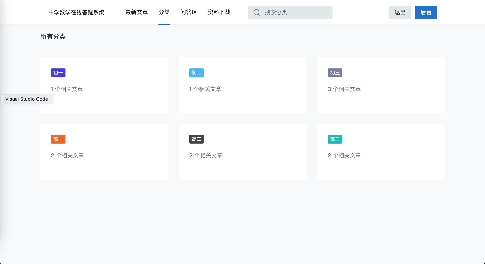
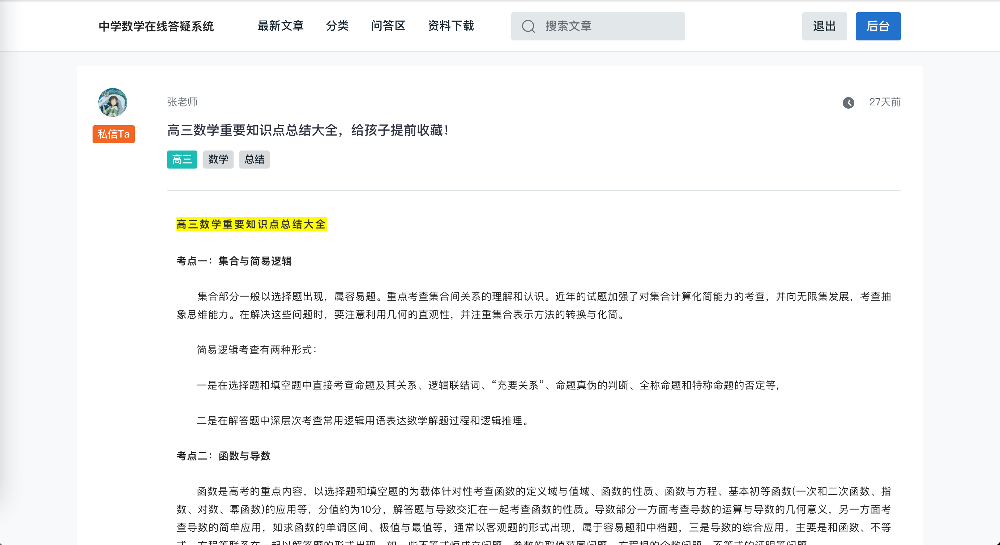
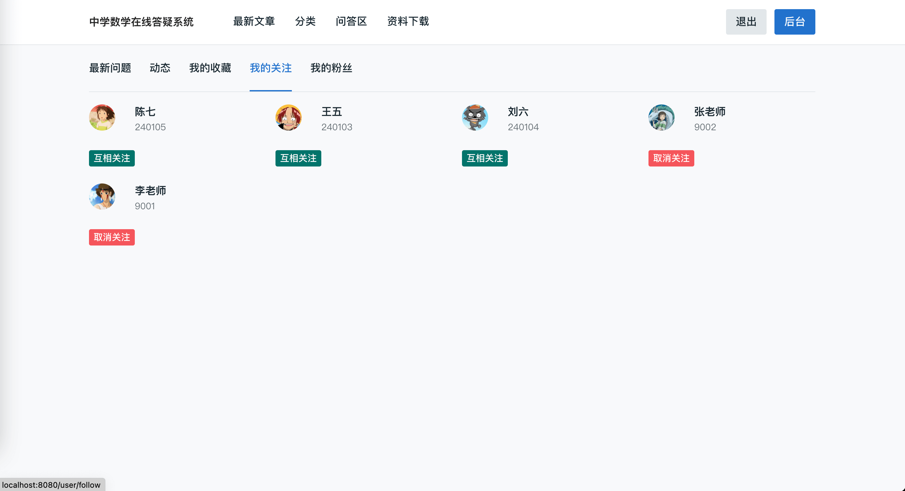
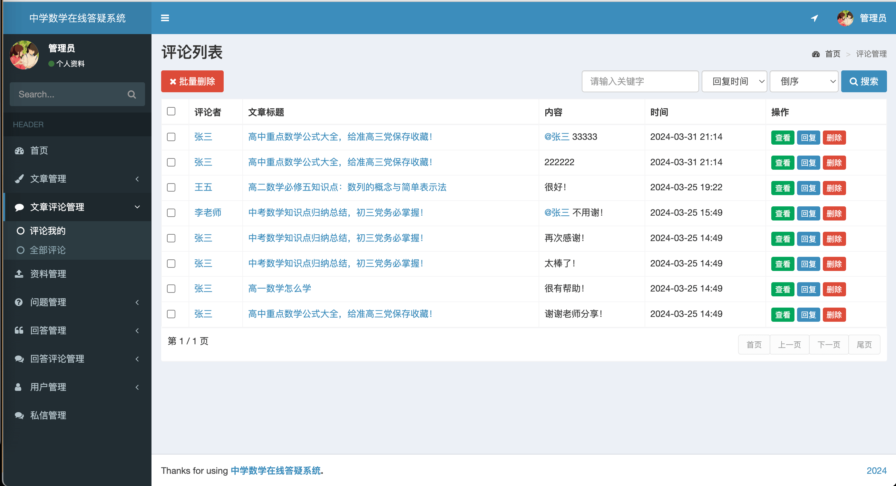
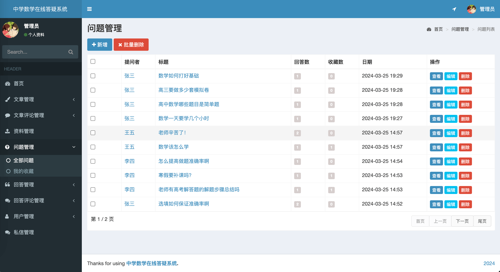
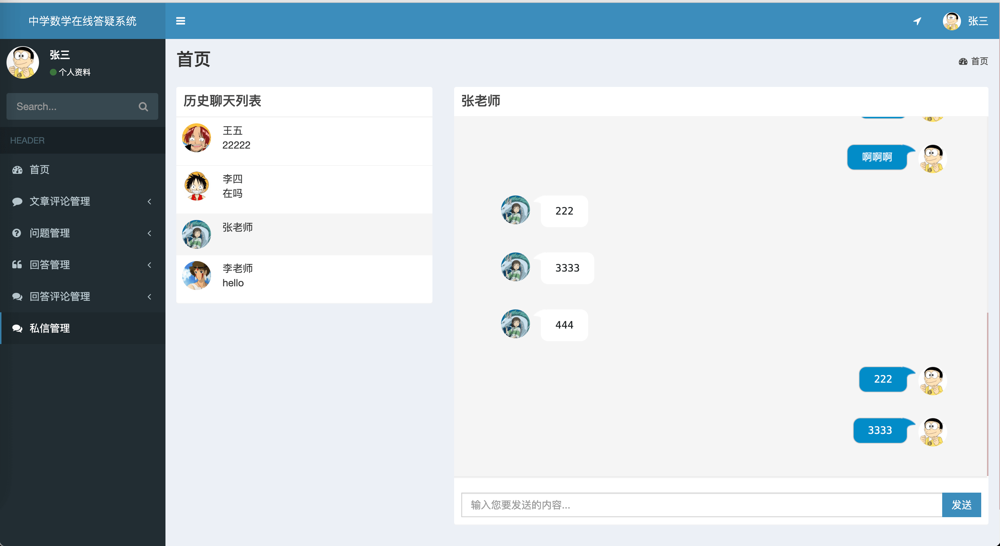

- 2024 基于在线答疑系统 论坛系统 学习交流系统
- 预览地址：[http://studyqa.liuyanzhao.com](http://studyqa.liuyanzhao.com)
- 详细介绍地址：[https://liuyanzhao.com/shop/studyqa.html](https://liuyanzhao.com/shop/studyqa.html)
- 演示视频：链接:https://pan.baidu.com/s/1mG1HirvwVyidnsBIsFSpMQ  密码:ux0z


# 一、用户需求

```
管理员：
    首页
    文章管理  - 所有的
    文章评论管理  - 所有的
    资料管理  - 所有的
    问题管理 - 所有的
    回答管理 - 所有的   
    回答的评论管理 - 所有的
    用户管理 - 所有的
    私信管理
    个人信息

老师：（老师无问题管理）
    首页
    文章管理  - 自己的
    文章评论管理  - 自己的
    资料管理  - 自己的
    问题管理 - 自己的
    回答管理 - 自己的    
    回答的评论管理 - 自己的
    私信管理
    个人信息

学生：（学生无文章管理和资料管理）
    首页
    文章评论管理 - 自己的
    问题管理 - 自己的
    回答管理 - 自己的   
    回答的评论管理 - 自己的
    私信管理
    个人信息
```

# 二、技术组成

- 1、SpringBoot
- 2、MyBatis / MyBatis Plus
- 3、Thymeleaf
- 4、Bootstrap
- 5、MySQL

# 三、项目部分功能截图

1-首页.png

2-问答列表.png

3-文章分类.png

4-资料下载.png

5-文章详情1.png

5-文章详情2.png

6-好友动态.png

7-我的关注.png

8-文章管理.png

9-评论管理.png

10-问题管理.png

11-回答管理.png

12-用户管理.png

13-私信管理.png


# 四、联系方式

需要完整代码联系博主，微信847064370


